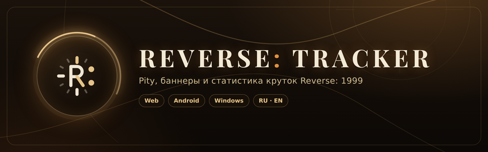

<p align="center">
  
</p>

<p align="center">
  <a href="https://lonelytragedy.github.io/r1999-tracker/"><b>Открыть трекер</b></a> ·
  <a href="https://github.com/lonelytragedy/r1999-TrackerApp/releases/latest">Приложение для Android</a> ·
  <a href="https://github.com/lonelytragedy/r1999-SummonHistoryLinkGrabber/releases/latest">Граббер ссылки для Windows</a> ·
  <a href="https://lonelytragedy.github.io/r1999-tracker/guide.html">Гайд</a>
</p>

**Reverse: Tracker** — трекер круток для Reverse: 1999. Загружает историю призывов из игры и показывает текущий pity, гарант, баннеры и статистику. Работает в браузере на ПК и телефоне, данные хранятся на устройстве.

## Возможности

- **Текущий pity** по каждому типу баннеров (из 70) с цветовой подсказкой: до 50, 50–59, 60+. Метка «Гарант» показывает, что прошлый 50/50 проигран и следующий 6★ будет персонажем с баннера.
- **Баннеры**: что идёт сейчас и что скоро, с таймером до конца или начала и твоим pity на каждом. По нажатию открываются персонажи баннера и твои крутки на нём. Есть вид сеткой и таймлайн.
- **Последние 6★**: портреты, pity, на котором они выпали, и счёт побед 50/50.
- **Статистика и графики**: всего круток, число и доля 6★, средний pity, распределение 6★ по pity, крутки по месяцам.
- **История круток** с фильтрами по редкости и типу баннера (можно выбрать несколько сразу). Десятки сгруппированы.
- **Профили** для нескольких аккаунтов. Профиль привязывается к UID при первом импорте, поэтому крутки разных аккаунтов не смешаются.
- **Резервная копия**: все профили в одном JSON-файле, при загрузке профили объединяются без дублей.
- **Синхронизация с Google Диском**: данные лежат в скрытой папке приложения и сохраняются сами после каждого импорта.
- **Офлайн-режим**: трекер открывается без интернета, онлайн-функции на это время отключаются.
- **Два скина**: Reversed (золото и тёмное дерево) и Classic (спокойный тёмный).
- **Русский и английский** интерфейс.
- **Мобильная версия** с нижней панелью и окном «Добавить крутки».

## Экосистема

| | Что это | Где взять |
|---|---|---|
| **Трекер** (этот репозиторий) | Сайт на чистом HTML/CSS/JS, GitHub Pages | [lonelytragedy.github.io/r1999-tracker](https://lonelytragedy.github.io/r1999-tracker/) |
| **Приложение для Android** | Трекер и автоматический перехват ссылки в одном приложении, root не нужен | [r1999-TrackerApp](https://github.com/lonelytragedy/r1999-TrackerApp) · [скачать APK](https://github.com/lonelytragedy/r1999-TrackerApp/releases/latest) |
| **Граббер ссылки для Windows** | Python-скрипт / .exe, ловит ссылку на историю круток, пока ты открываешь её в игре | [r1999-SummonHistoryLinkGrabber](https://github.com/lonelytragedy/r1999-SummonHistoryLinkGrabber) · [скачать .exe](https://github.com/lonelytragedy/r1999-SummonHistoryLinkGrabber/releases/latest) |

### Приложение для Android

- Перехват ссылки через локальный VPN прямо на телефоне или через Wi-Fi прокси. Перехватывается только запрос к истории круток, остальной трафик игры идёт как обычно.
- Пойманная ссылка импортируется в трекер в одно касание.
- Виджет на рабочий стол: отсчёт до ежедневного сброса, текущие и будущие баннеры с таймерами.
- Уведомления о новых баннерах и за 24 часа до конца лимитированных. Расписание обновляется само, даже если приложение не открывать.
- Встроенное обновление: приложение находит новую версию, скачивает и предлагает установить.
- Язык и скин приложения следуют настройкам трекера.

## Как загрузить историю круток

Трекеру нужна ссылка на историю призывов из игры. Она выглядит так:

```
https://game-re-en-service.sl916.com/query/summon?userId=…&token=…
```

Где в трекере импорт:

- **На ПК** — блок «Управление базой данных» вверху страницы: поле для ссылки и «Импорт по ссылке», «Выбрать файл», профили, резервная копия, Google Диск.
- **На телефоне** — кнопка загрузки в шапке открывает окно «Добавить крутки».

### Способ 1. Приложение для Android (рекомендуется)

1. Установи [последний APK](https://github.com/lonelytragedy/r1999-TrackerApp/releases/latest). В первый раз Android попросит разрешить установку из этого источника.
2. Войди в игру до запуска перехвата.
3. В приложении открой вкладку **Импорт** в нижней панели, выбери **VPN** и нажми **Запустить перехват**, затем **Открыть Reverse: 1999**.
4. Опусти шторку уведомлений и нажми **«Запустить VPN»**. В первый раз Android попросит разрешить VPN.
5. Если игра потеряла соединение, нажми в ней Reconnect. Открой **Призыв → История**, иногда это нужно сделать 2–3 раза.
6. Когда ссылка поймана, придёт уведомление, а VPN выключится сам. Нажми уведомление, и крутки загрузятся в трекер.

Если VPN не подходит, на экране «Импорт» есть режим **Wi-Fi прокси**: адрес и шаги показаны прямо там.

### Способ 2. Граббер ссылки для Windows (рекомендуется)

1. Скачай [последний релиз](https://github.com/lonelytragedy/r1999-SummonHistoryLinkGrabber/releases/latest) и запусти `R1999LinkGrabber.exe`. В консоли появится:
   ```
   Proxy enabled: 127.0.0.1:8080
   Starting capture...
   Launch the game and open summon history
   ```
2. Запусти Reverse: 1999 и открой **Призыв → История**. Программа найдёт ссылку и скопирует её в буфер обмена:
   ```
   === SUMMON LINK FOUND ===
   https://game-re-en-service.sl916.com/query/summon?...
   Link copied to clipboard
   ```
3. Вставь ссылку в трекер и нажми **Импорт по ссылке**.

> [!WARNING]
> Не закрывай консоль крестиком: системный прокси может остаться включённым. Выходи через `Ctrl + C` или дождись, пока программа завершится сама.
> Если прокси всё же остался включён: Параметры → Сеть и Интернет → Прокси → Настройка прокси вручную → выключи «Использовать прокси-сервер».

Запуск Python-скрипта напрямую (Python 3.10–3.12):

```bash
pip install mitmproxy pyperclip
python R1999LinkGrabber.py
```

### Способ 3. Fiddler

1. Установи [Fiddler Classic](https://www.telerik.com/fiddler/fiddler-classic), запусти его и Reverse: 1999, открой **Призыв → История**.
2. Найди в Fiddler запрос к `game-re-en-service.sl916.com/query/summon`.
3. Выдели строку → ПКМ → **Copy → Just URL**.
4. Вставь ссылку в трекер и нажми **Импорт по ссылке**.

### Способ 4. JSON-файл вручную

1. Получи ссылку любым способом выше и открой её в браузере.
2. Сохрани страницу как файл: ПКМ → «Сохранить как».
3. В трекере нажми **Выбрать файл** и выбери сохранённый JSON.

> [!NOTE]
> «Выбрать файл» принимает только оригинальный ответ из игры. Резервную копию трекера загружай через «Загрузить базу данных».

## Профили, резервная копия и синхронизация

- **Профили.** На ПК переключаются в блоке «Управление базой данных», на телефоне — нажатием на имя профиля в шапке. Если загрузить ссылку от другого аккаунта, трекер предложит создать для него отдельный профиль. Стандартный профиль удалить нельзя, только очистить.
- **Резервная копия.** «Скачать базу данных» сохраняет все профили в один JSON. «Загрузить базу данных» возвращает копию: профили с тем же UID объединяются, при совпадении только имени трекер спросит, что сделать.
- **Google Диск.** Нажми «Подключить» на карточке Google Drive и разреши доступ. Дальше трекер сам загружает данные из облака и сохраняет изменения через пару секунд после каждого импорта. Если в облаке данных меньше, чем на устройстве, появится окно с выбором.

## Приватность

- История круток и профили хранятся в браузере (`localStorage`) на твоём устройстве.
- Ссылка на историю содержит токен твоей сессии. Не публикуй её: по ней можно посмотреть историю призывов аккаунта.
- Google Диск используется только с доступом `drive.appdata`: трекер видит лишь свою скрытую папку, а не твои файлы.
- Перехват в приложении и граббере затрагивает только запрос к истории круток и не меняет игровые данные.

## Для разработчиков

Сайт статический, сборка не нужна.

```bash
git clone https://github.com/lonelytragedy/r1999-tracker.git
cd r1999-tracker
python3 -m http.server 8000
```

Откройте <http://localhost:8000>.

| Файл | Назначение |
|---|---|
| `index.html`, `styles.css`, `scripts.js` | Трекер: разметка, стили (обе версии и скины), логика |
| `database.js` | Персонажи и баннеры (`BANNERS`, `ACTIVE_BANNERS`). Приложение для Android тоже читает этот файл для уведомлений и виджета |
| `localization/ru.js`, `localization/en.js` | Тексты интерфейса |
| `gdrive.js`, `worker.js` | Синхронизация с Google Диском и Cloudflare Worker для OAuth |
| `net.js`, `sw.js` | Проверка сети и service worker для офлайн-режима |
| `icons.js` | Иконки [Lucide](https://lucide.dev) |
| `guide.html` | Гайд по импорту |

Новый баннер добавляется в `database.js`: запись в `BANNERS` и даты в `ACTIVE_BANNERS`. Картинки баннеров лежат в `static/banners/` в формате WebP.

## English

**Reverse: Tracker** is a pull tracker for Reverse: 1999. It loads your summon history from the game and shows current pity, guarantee status, live and upcoming banners, stats and full pull history. It runs in the browser on desktop and mobile, with profiles, backups, Google Drive sync, offline mode, two skins and RU/EN interface.

To get your summon history link, use the [Android app](https://github.com/lonelytragedy/r1999-TrackerApp/releases/latest), the [Windows link grabber](https://github.com/lonelytragedy/r1999-SummonHistoryLinkGrabber/releases/latest), Fiddler, or a saved JSON file. Step-by-step instructions are in the [guide](https://lonelytragedy.github.io/r1999-tracker/guide.html) (switch it to EN in the top right).

---

Reverse: Tracker — фанатский проект, не связанный с Bluepoch. Reverse: 1999 и связанные материалы принадлежат их правообладателям.
